# Firebase Realtime Database Setup

## 1. Go to [firebase.google.com](https://firebase.google.com/)

## 2. Add project

### Give the project a name

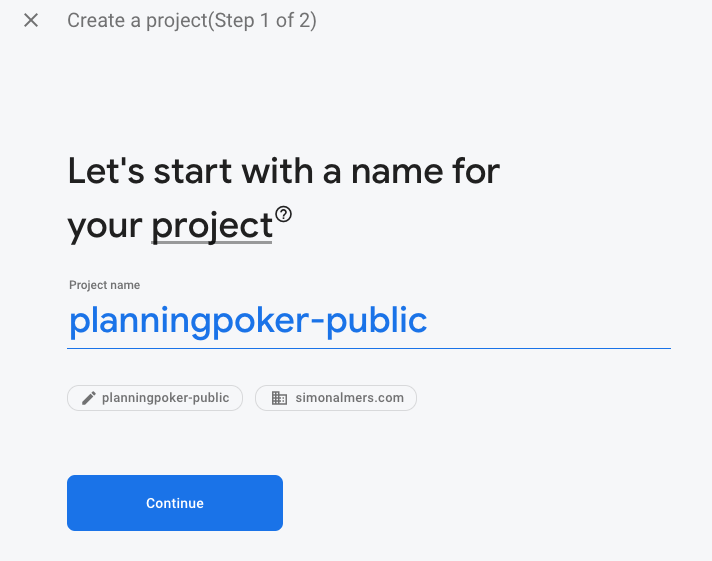

### Don't enable Google Analytics

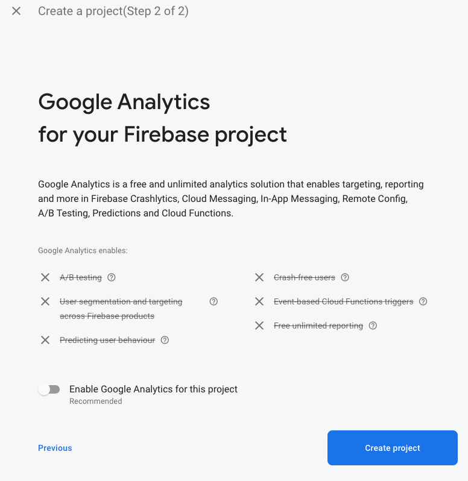

### Project is created

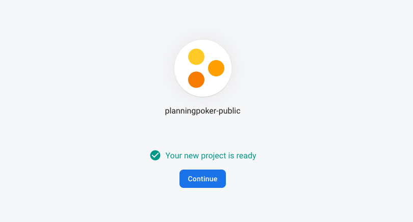

### On The Firebase Console, Click the "</>" button

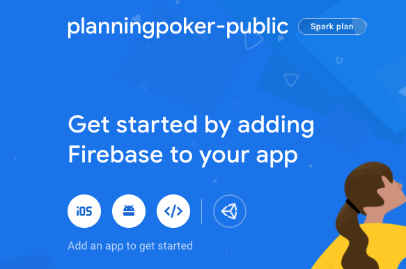

### Register web app

No need to select hosting.

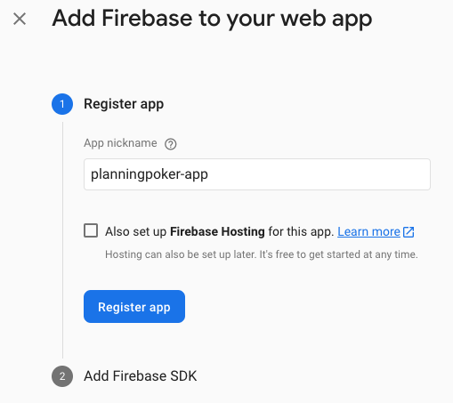

### Copy contents of `firebaseConfig` to your `.env` file

Continue to console

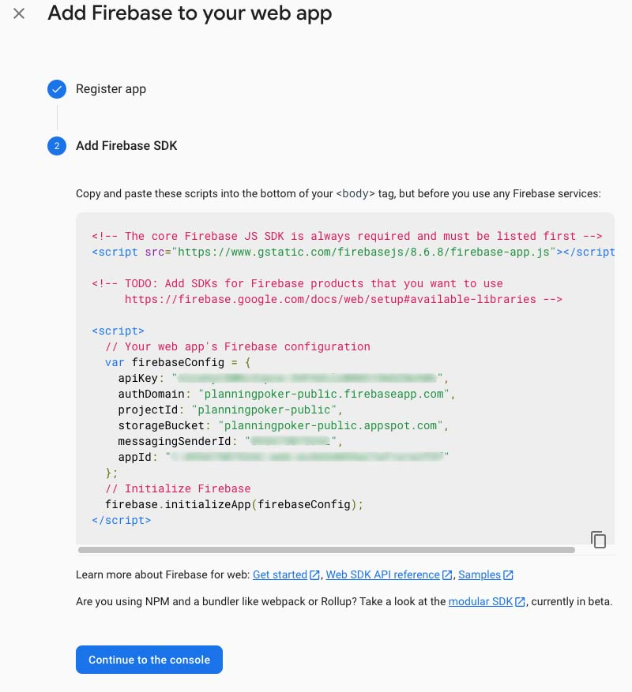

```javascript
var firebaseConfig = {
  apiKey: "******",
  authDomain: "planningpoker-public.firebaseapp.com",
  projectId: "planningpoker-public",
  storageBucket: "planningpoker-public.appspot.com",
  messagingSenderId: "******",
  appId: "******",
};
```

```bash

FIREBASE_API_KEY=***
FIREBASE_AUTH_DOMAIN=planningpoker-public.firebaseapp.com
FIREBASE_PROJECT_ID=planningpoker-public
FIREBASE_STORAGE_BUCKET=planningpoker-public.appspot.com
FIREBASE_MESSAGING_SENDER_ID=***
FIREBASE_APP_ID=***
```

### Also add the url found in the root of the database to the `.env` file

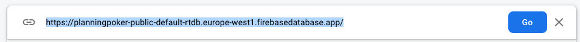

```bash
FIREBASE_DATABASE_URL=https://planningpoker-public-default-rtdb.europe-west1.firebasedatabase.app/
```

### Click the Realtime Database link in the menu

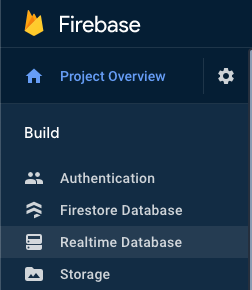

### Create Realtime Database

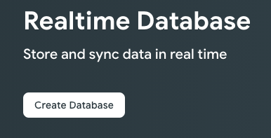

### Select Database Location

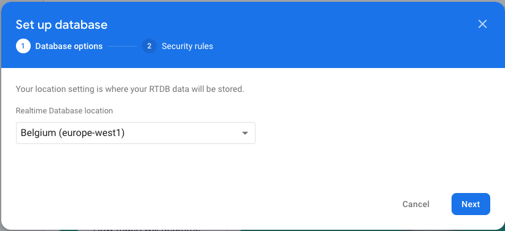

### Select Database Security Rules to `test mode`

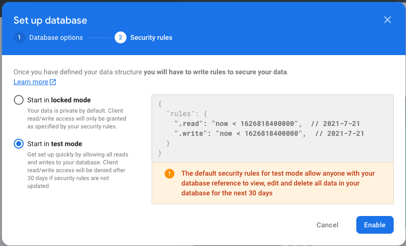

### The Database is now created!

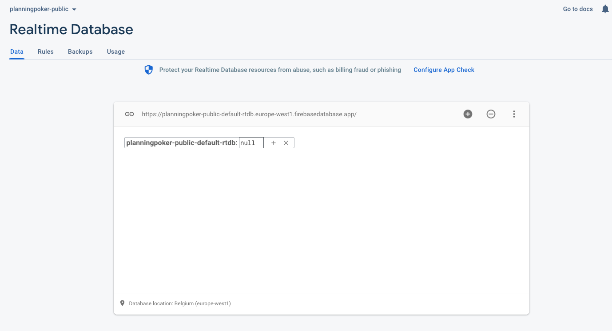

### The Database is now created!

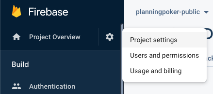

### The Database is now created!

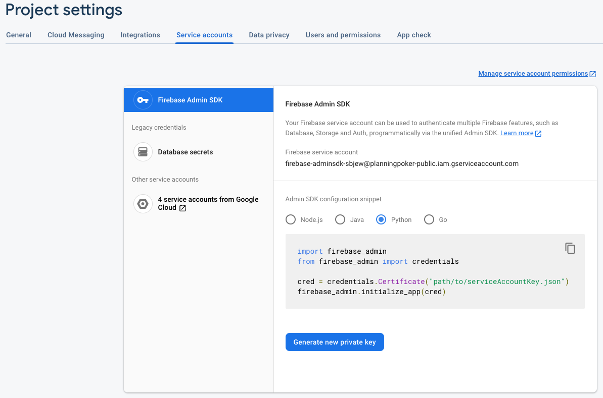

### Generate Firebase AdminSDK Key JSON-file

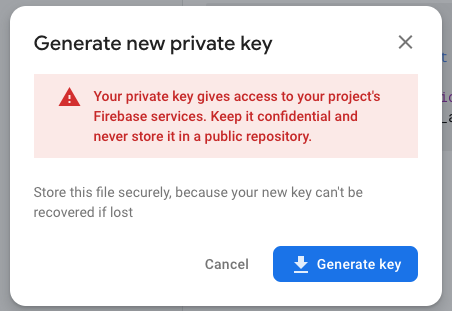

### Rename the JSON-File and put it in the Root of the BACKEND Repo

`planning-poker-base.adminsdk.json`

# Now we should be good to go!

[Back To README](/README.md)
